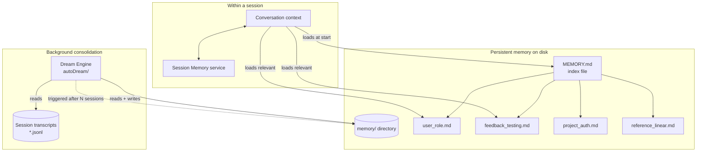
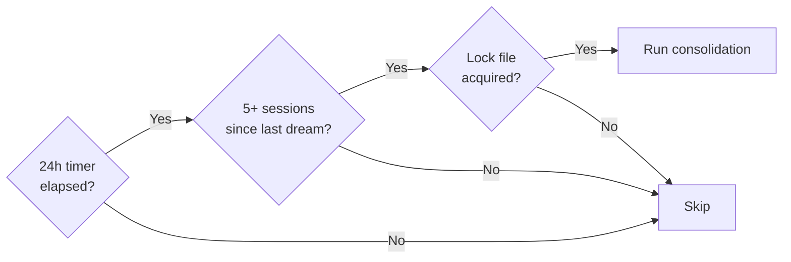
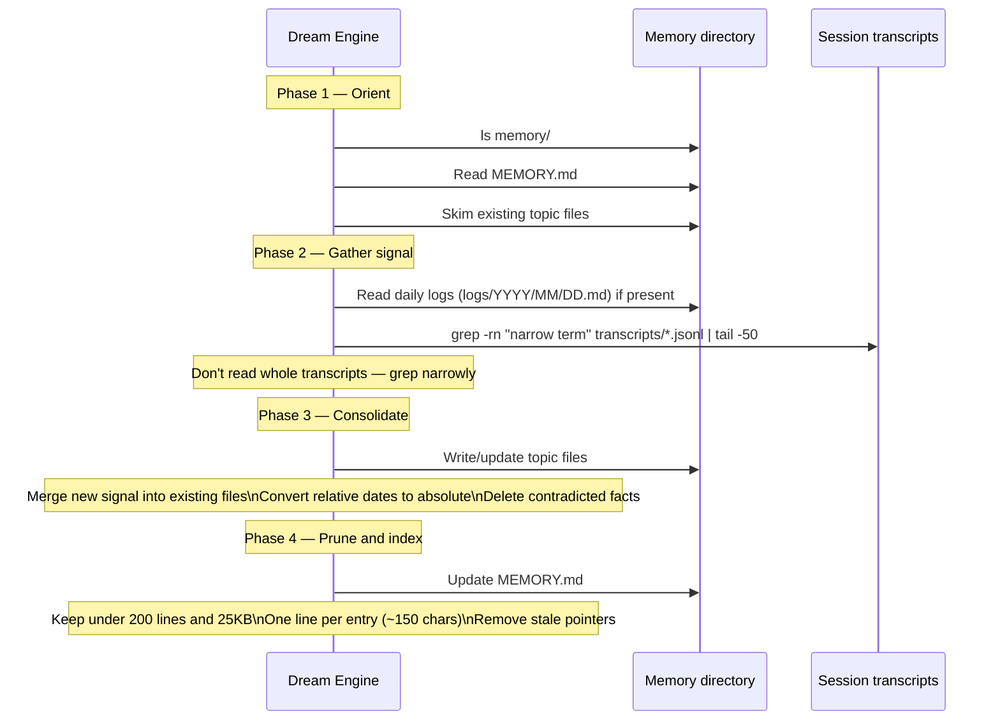
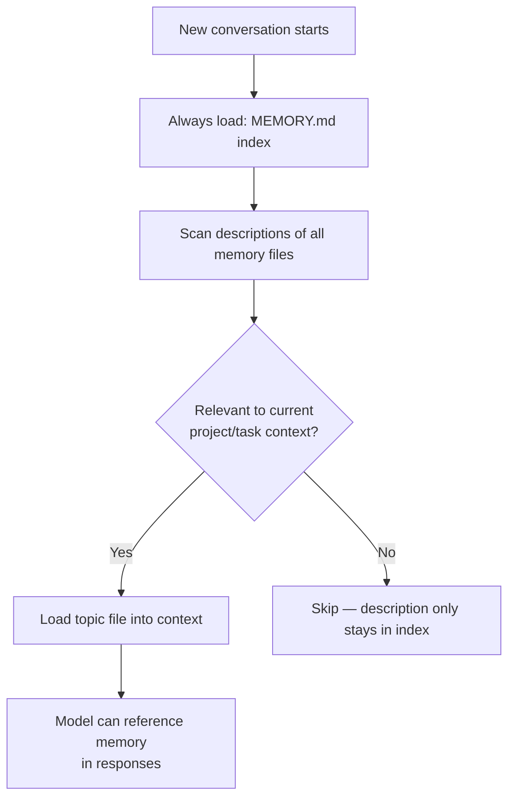
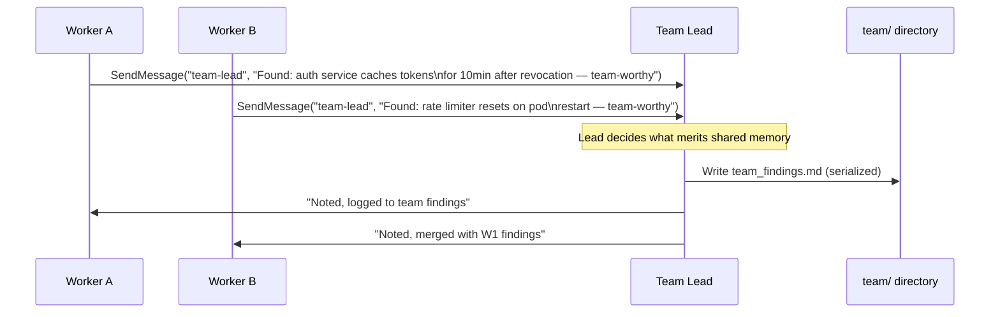

# Memory System

Claude Code has two complementary memory mechanisms: **session memory** (what the model knows during a conversation) and **persistent memory** (what survives across sessions). The persistent memory system — including an automated background consolidation engine called "Dream" — is the more architecturally interesting of the two.

---

## Overview



---

## Memory File Layout

Persistent memory lives under a root directory (typically `~/.claude/projects/<project>/memory/`). The structure is:

```
memory/
  MEMORY.md           ← always loaded — index/table of contents only
  user_role.md        ← who the user is, their expertise
  feedback_testing.md ← behavioral correction: "don't mock the database"
  project_auth.md     ← ongoing project context
  reference_linear.md ← pointers to external systems
```

### MEMORY.md — the index

`MEMORY.md` is loaded into every conversation. It must stay **under 200 lines** — beyond that it gets truncated. Its only job is to point to topic files:

```markdown
## User
- [Role & expertise](user_role.md) — senior iOS engineer, new to the backend

## Feedback
- [Testing conventions](feedback_testing.md) — real DB, no mocks; terse responses

## Project
- [Auth rewrite](project_auth.md) — compliance-driven, JWT migration underway

## References
- [Bug tracker](reference_linear.md) — pipeline bugs in Linear project "INGEST"
```

Never write memory content directly into `MEMORY.md`. It's an index, not a dump.

### Memory file format

Each topic file uses frontmatter:

```markdown
---
name: Testing conventions
description: How this project runs tests — important for not repeating past mistakes
type: feedback
---

Always use real database connections in tests, never mocks.

**Why:** Mocked tests passed but the prod migration failed last quarter because
mock/prod divergence wasn't caught until deployment.

**How to apply:** Any time writing or reviewing integration tests — default to
real connections. Raise it explicitly if someone proposes mocking a DB call.
```

The `description` field is used to decide relevance when loading memories for a new conversation — it's the hook that determines whether a memory gets loaded, so it must be specific.

---

## Memory Types

| Type | What it stores | When to write |
|------|---------------|--------------|
| `user` | Role, expertise, preferences, learning goals | When you learn something about who the person is |
| `feedback` | Corrections, behavioral rules, things to avoid | When the user says "don't do X" or corrects your approach |
| `project` | Ongoing work, decisions, deadlines, bugs | When you learn why something is happening, not just what |
| `reference` | Pointers to external systems (Linear, Grafana, Slack) | When you learn where information lives |

### What NOT to save

The system explicitly excludes:
- Code patterns, conventions, architecture — derivable from reading the code
- Git history — `git log` / `git blame` are authoritative
- Debugging solutions — the fix is in the code; the commit message has the context
- Ephemeral task details — current session state, in-progress work
- Things already in `CLAUDE.md`

---

## The Dream Engine — Background Memory Consolidation

The Dream engine (`services/autoDream/`) runs autonomously between sessions to consolidate what the model has learned into well-organized persistent memories.

### Trigger gates

Three conditions must all be true before Dream runs:



The lock file prevents two simultaneous Dream processes from conflicting (e.g., if multiple terminal sessions are open).

### Four-phase consolidation



### Consolidation prompt (actual source)

The Dream engine uses a specific prompt for its consolidation pass. Key excerpts that reveal the design thinking:

```
# Dream: Memory Consolidation

You are performing a dream — a reflective pass over your memory files.
Synthesize what you've learned recently into durable, well-organized
memories so that future sessions can orient quickly.

## Phase 2 — Gather recent signal

Don't exhaustively read transcripts. Look only for things you already
suspect matter.

grep -rn "<narrow term>" transcripts/ --include="*.jsonl" | tail -50

## Phase 3 — Consolidate

Focus on:
- Merging new signal into existing topic files rather than near-duplicates
- Converting relative dates ("yesterday") to absolute dates
- Deleting contradicted facts — if today's investigation disproves an
  old memory, fix it at the source

## Phase 4 — Prune and index

Update MEMORY.md so it stays under [MAX_LINES] lines AND under ~25KB.
It's an index, not a dump — each entry should be one line under ~150
characters: `- [Title](file.md) — one-line hook`.
```

The Dream engine has **read-only bash access** for project analysis — it can grep transcripts and read the filesystem, but cannot run arbitrary commands or make writes outside the memory directory.

---

## Memory Loading Strategy

Not all memories are loaded for every conversation. The `description` field in each memory's frontmatter is used as a relevance signal:



This is why the `description` field must be specific. A vague description like "some testing notes" won't trigger loading when it's needed. A specific one like "how this project runs tests — no mocks, real DB required" will.

---

## Session Memory vs. Persistent Memory

| | Session Memory | Persistent Memory (Dream) |
|---|---|---|
| Scope | Current conversation only | Survives across all sessions |
| Written by | Model during conversation | Model during Dream pass |
| Format | Internal message history | Markdown files on disk |
| Capacity | Context window | Unbounded (but indexed tightly) |
| Loaded when | Always | Selectively by relevance |
| Updated how | Automatically as conversation progresses | Triggered by Dream gates |

---

## Team Memory

In swarm/teammate mode, memory has an additional layer — shared team memory that all agents in a team can access:

```
memory/
  MEMORY.md             ← personal memory index
  team/
    TEAM_MEMORY.md      ← team-shared memory index
    team_decisions.md   ← cross-agent decisions
    team_findings.md    ← shared research results
```

Team memory uses the same file format as personal memory, but the write protocol requires coordination — agents use `SendMessage` to flag team-worthy findings to the team lead rather than writing directly.

---

### The Write Coordination Problem

Personal memory has one writer — one agent, one session at a time. Team memory has `n` writers, all potentially active simultaneously. Without coordination, two workers writing concurrent findings to `team_findings.md` will produce a last-write-wins conflict where one agent's observations silently overwrite the other's.

The solution is to treat the team lead as the memory arbiter. Workers never write to `team/` directly — they flag, the lead writes.



This serialization is the key property. Workers produce findings; the lead decides whether they're durable enough to be team-shared, and performs the write.

---

### What Belongs in Team Memory vs. Personal Memory

Not every finding is team-worthy. The bar is higher for team memory because it becomes part of every agent's starting context.

| Finding type | Personal memory? | Team memory? | Reason |
|---|---|---|---|
| "This user prefers terse responses" | Yes | No | Individual preference, not cross-agent |
| "auth.ts line 42 crashes on expired tokens" | No | **Yes** | Any worker touching auth needs this |
| "the scratchpad approach the team agreed on" | No | **Yes** | Affects all agents' behavior |
| "this sprint's deadline is 2026-04-15" | No | **Yes** | Constrains all agents' prioritization |
| "test runner times out in CI — known issue" | No | **Yes** | Prevents every worker from re-investigating it |
| "I tried approach X and it didn't work" | Yes | Depends | Team-worthy if it would waste another worker's time |

The heuristic: **would another worker starting fresh make a worse decision without knowing this?** If yes, it's team-worthy.

---

### Team Memory Types

Team memory uses the same four types as personal memory, but the semantics shift slightly:

| Type | Team meaning | Example |
|---|---|---|
| `user` | Shared understanding of the human stakeholders | "Product owner is @alice — she has final say on API shape" |
| `feedback` | Decisions all agents must respect | "Don't rewrite tests — team lead approved approach only" |
| `project` | Cross-cutting facts about the current mission | "We're mid-migration: old and new auth endpoints coexist until 2026-04-15" |
| `reference` | Shared pointers to external systems | "Scratchpad at `/tmp/team-scratchpad/` — all workers can write" |

The `feedback` type is particularly important at team scope. When the team lead makes an architectural call — "serialize writes to the migration table, don't use transactions here" — that constraint needs to live in team memory, not in the lead's private notes, so every worker inherits it on spawn.

---

### TEAM_MEMORY.md — the Shared Index

`TEAM_MEMORY.md` follows the same rules as `MEMORY.md`: it's an index, not a dump; it must stay under 200 lines; each entry is a single line pointing to a topic file.

```markdown
## Decisions
- [API shape decisions](team_decisions.md) — agreed surface area for the migration endpoints

## Findings
- [Auth service behavior](team_findings.md) — token revocation lag, rate limiter restart behavior

## References
- [Shared scratchpad](team_reference_scratchpad.md) — /tmp/team-scratchpad/, all workers can write
```

One practical difference from personal `MEMORY.md`: workers read `TEAM_MEMORY.md` at spawn time as part of their briefing context. The coordinator should include it in the worker's prompt explicitly — it isn't auto-loaded the way personal memory is.

```
// Good worker prompt — explicitly passes team context
"Your task: investigate the rate limiter.
 Before you start, read memory/team/TEAM_MEMORY.md and load relevant topic files.
 You will find a findings log in team_findings.md — append your observations there
 via SendMessage to team-lead, do not write directly."
```

---

### Conflict Resolution in Team Memory

Personal memory has one contradiction source: new evidence disproving an old belief held by one agent. Team memory has two:

1. **Sequential contradiction** — a later finding overturns an earlier one
2. **Concurrent contradiction** — two workers investigating the same area reach different conclusions

The team lead handles both at write time. When a worker flags a finding, the lead reads the current state of the relevant topic file before writing, and reconciles explicitly:

```
W2 reports: "rate limiter resets on pod restart"
Lead reads team_findings.md: "rate limiter state is durable across restarts [W1, 2026-04-01]"

→ Contradiction. Lead must resolve before writing:
   - Which is more recent?
   - Was W1 testing a different environment?
   - Flag for user confirmation if the difference matters for the mission?
```

Without this explicit reconciliation step, team memory degrades into a log of conflicting assertions — high noise, low signal. The lead's job isn't just to serialize writes; it's to synthesize them.

---

### Team Dream — Who Consolidates Shared Memory?

The personal Dream engine runs on a per-project schedule for a single user. Team memory requires a different trigger: it should consolidate after the swarm session completes, not during it.

The pattern:

1. During the swarm: the team lead writes to `team/` as findings arrive — no consolidation yet
2. At session end: the team lead (or a designated cleanup worker) runs a consolidation pass over `team/`
3. The consolidation prompt is identical in structure to the personal Dream prompt — orient, gather, consolidate, prune — but scoped to the `team/` subdirectory

The key difference from personal Dream: team consolidation should **not** run autonomously on a timer. It should be triggered explicitly at the end of each swarm session, because team memory is inherently tied to a specific collaborative session with a defined start and end.

---

### Staleness and Team Memory Lifetime

Team memory can go stale faster than personal memory. A personal feedback memory ("don't mock the DB") might hold for months. A team finding ("the migration table has 1.2M rows as of 2026-04-01") might be outdated in days.

Two mitigations:

1. **Absolute dates on all team findings.** Every entry in `team_findings.md` should include the timestamp when the finding was recorded. Workers reading old entries can judge whether to re-verify.

2. **Explicit TTL markers for volatile findings.** For fast-changing facts, the team lead should include a recommended re-verify date:

```markdown
## Auth token revocation lag

Observed: auth service holds tokens valid for ~10min after revocation.
Recorded: 2026-04-01 by Worker A.
Re-verify by: 2026-04-08 — this is the auth team's known bug, fix expected in next deploy.
```

This turns team memory into a living document rather than a fossil record.

---

## Applying These Patterns

1. **Index vs. content separation.** The MEMORY.md/topic-file split — a lean index always loaded, content loaded selectively — is the right pattern for any system where you need to stay within a context budget. Never put content in the index.

2. **Descriptions are the retrieval mechanism.** The quality of a memory's `description` field determines when it gets loaded. Invest in specificity: "no mocks — past incident" retrieves better than "testing notes."

3. **Background consolidation with gates.** Consolidation doesn't run every session — it waits for enough signal to accumulate. Time + volume + lock is a clean three-gate pattern that prevents both too-frequent consolidation (expensive) and staleness (useless).

4. **Absolute dates over relative.** Any system that stores observations must convert relative time references ("yesterday", "last sprint") to absolute dates at write time. Relative references rot; absolute ones don't.

5. **Memory types with explicit "why" and "how to apply."** The `feedback` type is most powerful with structure: the rule, the reason it exists, and when to apply it. Without the "why," a future session can't judge whether the rule still applies in edge cases.

6. **Contradiction resolution as first-class operation.** The consolidation prompt explicitly instructs: "if today's investigation disproves an old memory, fix it at the source." Memory systems that only append become unreliable over time. Contradiction resolution must be explicit.
