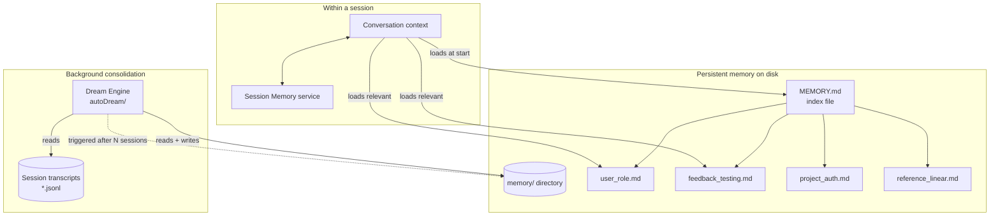
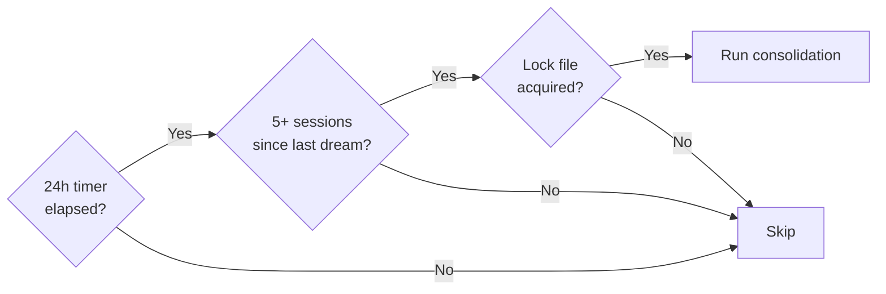
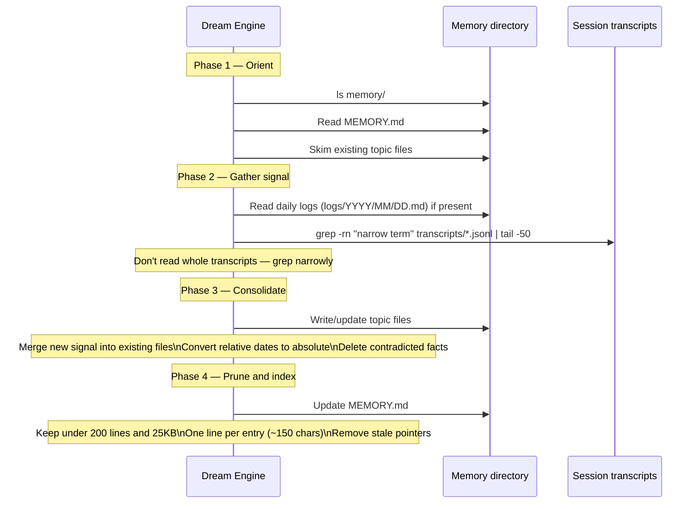
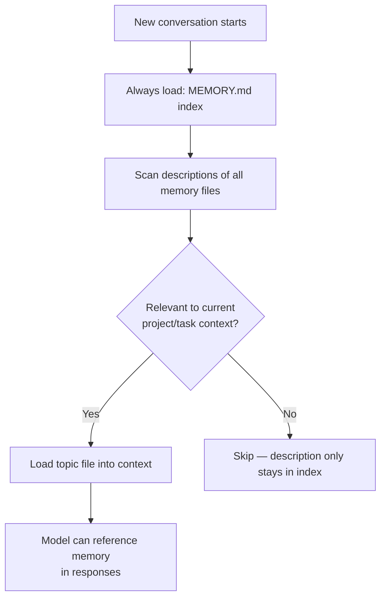

# Memory System

Claude Code has two complementary memory mechanisms: **session memory** (what the model knows during a conversation) and **persistent memory** (what survives across sessions). The persistent memory system — including an automated background consolidation engine called "Dream" — is the more architecturally interesting of the two.

---

## Overview



---

## Memory File Layout

Persistent memory lives under a root directory (typically `~/.claude/projects/<project>/memory/`). The structure is:

```
memory/
  MEMORY.md           ← always loaded — index/table of contents only
  user_role.md        ← who the user is, their expertise
  feedback_testing.md ← behavioral correction: "don't mock the database"
  project_auth.md     ← ongoing project context
  reference_linear.md ← pointers to external systems
```

### MEMORY.md — the index

`MEMORY.md` is loaded into every conversation. It must stay **under 200 lines** — beyond that it gets truncated. Its only job is to point to topic files:

```markdown
## User
- [Role & expertise](user_role.md) — senior iOS engineer, new to the backend

## Feedback
- [Testing conventions](feedback_testing.md) — real DB, no mocks; terse responses

## Project
- [Auth rewrite](project_auth.md) — compliance-driven, JWT migration underway

## References
- [Bug tracker](reference_linear.md) — pipeline bugs in Linear project "INGEST"
```

Never write memory content directly into `MEMORY.md`. It's an index, not a dump.

### Memory file format

Each topic file uses frontmatter:

```markdown
---
name: Testing conventions
description: How this project runs tests — important for not repeating past mistakes
type: feedback
---

Always use real database connections in tests, never mocks.

**Why:** Mocked tests passed but the prod migration failed last quarter because
mock/prod divergence wasn't caught until deployment.

**How to apply:** Any time writing or reviewing integration tests — default to
real connections. Raise it explicitly if someone proposes mocking a DB call.
```

The `description` field is used to decide relevance when loading memories for a new conversation — it's the hook that determines whether a memory gets loaded, so it must be specific.

---

## Memory Types

| Type | What it stores | When to write |
|------|---------------|--------------|
| `user` | Role, expertise, preferences, learning goals | When you learn something about who the person is |
| `feedback` | Corrections, behavioral rules, things to avoid | When the user says "don't do X" or corrects your approach |
| `project` | Ongoing work, decisions, deadlines, bugs | When you learn why something is happening, not just what |
| `reference` | Pointers to external systems (Linear, Grafana, Slack) | When you learn where information lives |

### What NOT to save

The system explicitly excludes:
- Code patterns, conventions, architecture — derivable from reading the code
- Git history — `git log` / `git blame` are authoritative
- Debugging solutions — the fix is in the code; the commit message has the context
- Ephemeral task details — current session state, in-progress work
- Things already in `CLAUDE.md`

---

## The Dream Engine — Background Memory Consolidation

The Dream engine (`services/autoDream/`) runs autonomously between sessions to consolidate what the model has learned into well-organized persistent memories.

### Trigger gates

Three conditions must all be true before Dream runs:



The lock file prevents two simultaneous Dream processes from conflicting (e.g., if multiple terminal sessions are open).

### Four-phase consolidation



### Consolidation prompt (actual source)

The Dream engine uses a specific prompt for its consolidation pass. Key excerpts that reveal the design thinking:

```
# Dream: Memory Consolidation

You are performing a dream — a reflective pass over your memory files.
Synthesize what you've learned recently into durable, well-organized
memories so that future sessions can orient quickly.

## Phase 2 — Gather recent signal

Don't exhaustively read transcripts. Look only for things you already
suspect matter.

grep -rn "<narrow term>" transcripts/ --include="*.jsonl" | tail -50

## Phase 3 — Consolidate

Focus on:
- Merging new signal into existing topic files rather than near-duplicates
- Converting relative dates ("yesterday") to absolute dates
- Deleting contradicted facts — if today's investigation disproves an
  old memory, fix it at the source

## Phase 4 — Prune and index

Update MEMORY.md so it stays under [MAX_LINES] lines AND under ~25KB.
It's an index, not a dump — each entry should be one line under ~150
characters: `- [Title](file.md) — one-line hook`.
```

The Dream engine has **read-only bash access** for project analysis — it can grep transcripts and read the filesystem, but cannot run arbitrary commands or make writes outside the memory directory.

---

## Memory Loading Strategy

Not all memories are loaded for every conversation. The `description` field in each memory's frontmatter is used as a relevance signal:



This is why the `description` field must be specific. A vague description like "some testing notes" won't trigger loading when it's needed. A specific one like "how this project runs tests — no mocks, real DB required" will.

---

## Session Memory vs. Persistent Memory

| | Session Memory | Persistent Memory (Dream) |
|---|---|---|
| Scope | Current conversation only | Survives across all sessions |
| Written by | Model during conversation | Model during Dream pass |
| Format | Internal message history | Markdown files on disk |
| Capacity | Context window | Unbounded (but indexed tightly) |
| Loaded when | Always | Selectively by relevance |
| Updated how | Automatically as conversation progresses | Triggered by Dream gates |

---

## Team Memory

In swarm/teammate mode, memory has an additional layer — shared team memory that all agents in a team can access:

```
memory/
  MEMORY.md             ← personal memory index
  team/
    TEAM_MEMORY.md      ← team-shared memory index
    team_decisions.md   ← cross-agent decisions
    team_findings.md    ← shared research results
```

Team memory uses the same file format as personal memory, but the write protocol requires coordination — agents use `SendMessage` to flag team-worthy findings to the team lead rather than writing directly.

---

## Applying These Patterns

1. **Index vs. content separation.** The MEMORY.md/topic-file split — a lean index always loaded, content loaded selectively — is the right pattern for any system where you need to stay within a context budget. Never put content in the index.

2. **Descriptions are the retrieval mechanism.** The quality of a memory's `description` field determines when it gets loaded. Invest in specificity: "no mocks — past incident" retrieves better than "testing notes."

3. **Background consolidation with gates.** Consolidation doesn't run every session — it waits for enough signal to accumulate. Time + volume + lock is a clean three-gate pattern that prevents both too-frequent consolidation (expensive) and staleness (useless).

4. **Absolute dates over relative.** Any system that stores observations must convert relative time references ("yesterday", "last sprint") to absolute dates at write time. Relative references rot; absolute ones don't.

5. **Memory types with explicit "why" and "how to apply."** The `feedback` type is most powerful with structure: the rule, the reason it exists, and when to apply it. Without the "why," a future session can't judge whether the rule still applies in edge cases.

6. **Contradiction resolution as first-class operation.** The consolidation prompt explicitly instructs: "if today's investigation disproves an old memory, fix it at the source." Memory systems that only append become unreliable over time. Contradiction resolution must be explicit.
