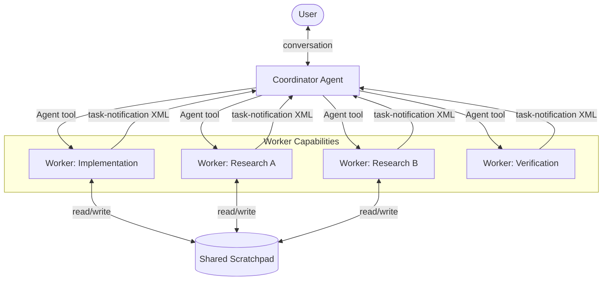
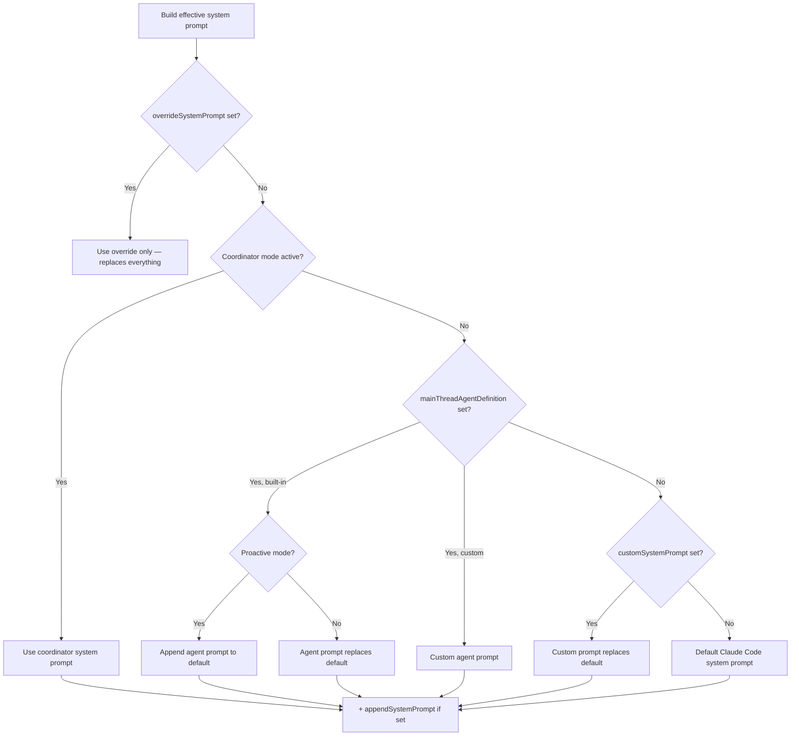
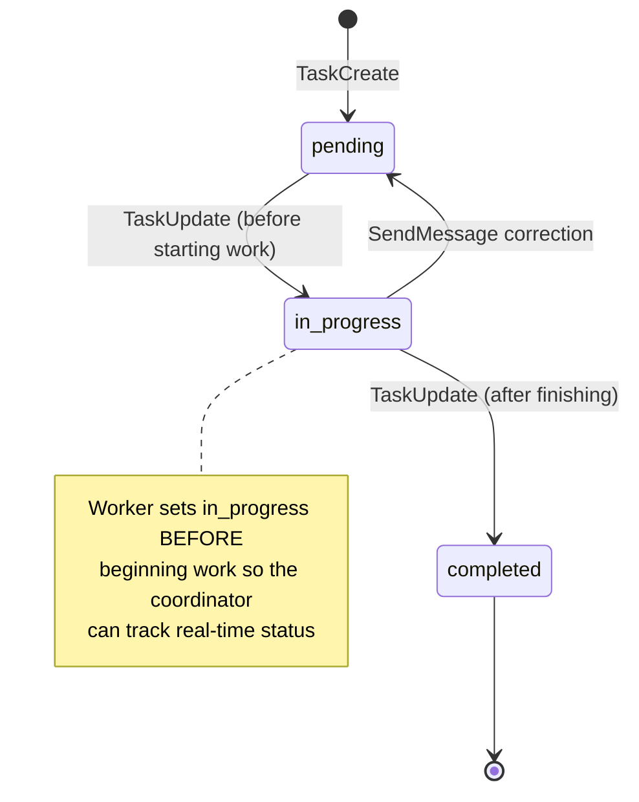
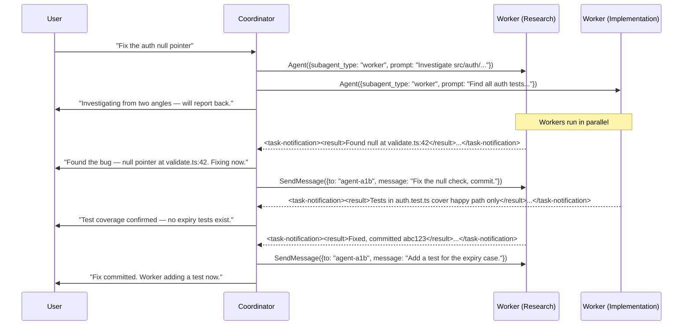
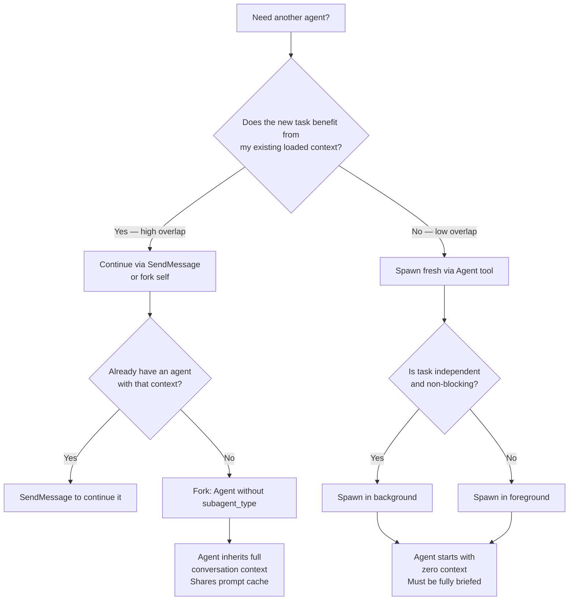
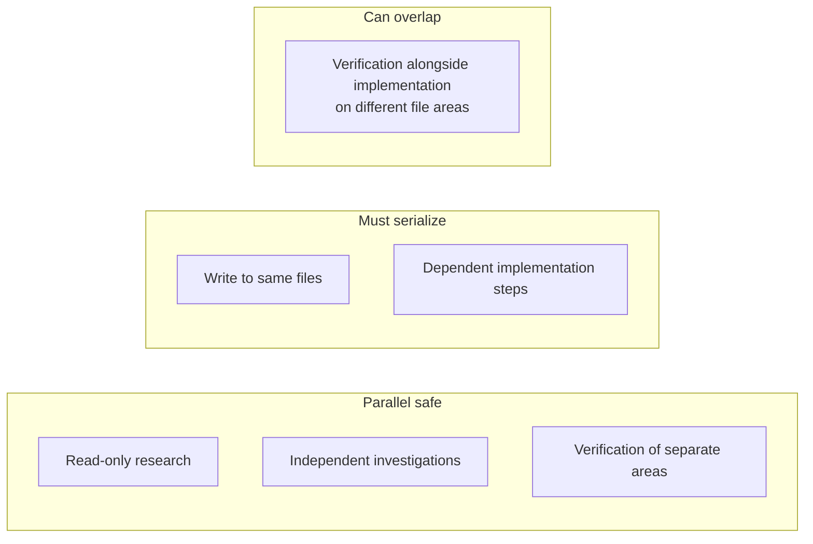

# Multi-Agent Orchestration

Claude Code's multi-agent system is built around a **coordinator/worker** model where a single orchestrating agent directs a swarm of autonomous workers. This document covers the architecture, communication patterns, and decision logic that make it effective.

---

## High-Level Architecture



The coordinator and user share one conversation thread. Workers are side processes — they run, report back via XML notifications, and the coordinator synthesizes results before responding to the user.

---

## System Prompt Priority

The effective system prompt changes entirely based on the active mode. This is a complete identity swap, not an addendum.



### Key insight
The coordinator is not "Claude Code with extra instructions." It is a different agent entirely — its prompt does not mention file editing or general coding; it only knows how to orchestrate workers.

---

## Task Lifecycle



Tasks are the unit of work assignment. Each task has:
- **subject** — imperative title ("Fix null pointer in auth module")
- **description** — full context for another agent to pick up
- **activeForm** — present-continuous label shown in UI spinner ("Fixing auth bug")
- **owner** — which worker holds it
- **blocks/blockedBy** — dependency graph

---

## Agent Communication Flow

Worker results arrive as `<task-notification>` XML injected into the conversation as user-role messages. This is the primary inter-agent communication channel.



### Notification format
```xml
<task-notification>
  <task-id>{agentId}</task-id>
  <status>completed|failed|killed</status>
  <summary>Human-readable outcome</summary>
  <result>Agent's final text output</result>
  <usage>
    <total_tokens>N</total_tokens>
    <tool_uses>N</tool_uses>
    <duration_ms>N</duration_ms>
  </usage>
</task-notification>
```

The `task-id` is the agent ID used to continue the worker via `SendMessage`.

---

## Fork vs. Spawn Decision

Claude Code supports two modes for launching sub-agents. Choosing correctly is a context-window optimization:



| Situation | Use | Why |
|-----------|-----|-----|
| Research worker explored the exact files that need editing | **Continue** (SendMessage) | Worker already has those files loaded |
| Research was broad, implementation is narrow | **Spawn fresh** | Avoid dragging exploration noise into focused work |
| Correcting a worker failure | **Continue** | Worker has the full error context |
| Independent verification of another worker's output | **Spawn fresh** | Verifier should see code with fresh eyes |
| Wrong approach taken entirely | **Spawn fresh** | Wrong-approach context pollutes the retry |
| Open-ended research question | **Fork** (no subagent_type) | Inherits context, shares cache, cheap |

### Fork mechanics
A fork:
- Inherits the parent's full conversation history
- Shares the parent's prompt cache (no cache-creation cost)
- Should never use a different model (breaks cache sharing)
- Returns results as a notification in a later turn — **do not peek at output mid-run**

---

## Coordinator Concurrency Rules



The rule: **read-only tasks fan out freely; write-heavy tasks serialize per file set**.

To launch parallel workers, include multiple `Agent()` tool calls in a single coordinator message. The model's turn boundary determines what runs concurrently.

---

## Worker Prompt Quality

The quality of a worker's output is almost entirely determined by the quality of its prompt. Workers cannot see the coordinator's conversation.

### Anti-patterns

```
// Bad — delegates understanding
"Based on your findings, fix the auth bug."

// Bad — no context
"Something went wrong with the tests, can you look?"

// Bad — ambiguous scope
"Create a PR for the recent changes."
```

### Good patterns

```
// Good — synthesized spec with file paths and line numbers
"Fix the null pointer in src/auth/validate.ts:42.
 The user field on Session (src/auth/types.ts:15) is undefined
 when sessions expire but the token remains cached.
 Add a null check before user.id access — if null, return 401
 with 'Session expired'. Run tests, commit, report the hash."

// Good — precise git operation
"Create a branch from main called 'fix/session-expiry'.
 Cherry-pick only commit abc123. Push and create a draft PR
 targeting main. Add anthropics/claude-code as reviewer.
 Report the PR URL."
```

### The synthesis principle

> **Never delegate understanding.** After workers report findings, the coordinator must read them, identify the approach, and write a prompt that proves it understood — with specific file paths, line numbers, and exactly what to change.

Phrases like "based on your findings" or "based on the research" are a smell: they push synthesis onto the worker instead of the coordinator.

---

## Teammate Swarm (Multi-Process)

Beyond the coordinator model, a separate swarm mode runs agents as independent processes (in separate tmux panes), communicating via named channels:

```mermaid
graph LR
    TL[Team Lead] -->|SendMessage to: "researcher"| R[Researcher Agent]
    TL -->|SendMessage to: "implementer"| I[Implementer Agent]
    R -->|SendMessage to: "team-lead"| TL
    I -->|SendMessage to: "*"| All[Broadcast to all]
    All --> TL
    All --> R
```

- `to: "<name>"` — direct message to named teammate
- `to: "*"` — broadcast (expensive, use sparingly)
- Plain text output is **not** visible to teammates — `SendMessage` is required
- Cross-session via Unix domain sockets: `to: "uds:/tmp/cc-socks/1234.sock"`
- Remote peers via Bridge: `to: "bridge:session_01AbCd..."`

### Structured protocol messages

Swarm agents can exchange structured control messages:

```json
// Shutdown request/response
{"to": "team-lead", "message": {"type": "shutdown_response", "request_id": "...", "approve": true}}

// Plan approval request/response
{"to": "researcher", "message": {"type": "plan_approval_response", "request_id": "...", "approve": false, "feedback": "add error handling"}}
```

---

## Key Terminology

| Term | Definition |
|------|-----------|
| **Coordinator** | The orchestrating agent. Has a different system prompt than workers — it only knows how to direct other agents, not do hands-on work. |
| **Worker** | An autonomous subagent spawned via the `Agent` tool. Has full tool access. Cannot see the coordinator's conversation. |
| **Fork** | A subagent that inherits the parent's full conversation context and shares its prompt cache. Created by calling `Agent` without a `subagent_type`. |
| **Spawn** | A fresh subagent with zero context. Must be fully briefed in the prompt. Created with a `subagent_type`. |
| **task-notification** | XML message delivered as a user-role message when a worker completes. Primary inter-agent communication channel. |
| **SendMessage** | Tool used to continue an existing worker (resume with context) or message a teammate by name. |
| **Synthesis** | The coordinator's core job: reading worker findings and producing specific, actionable prompts with file paths and line numbers. |
| **Shared scratchpad** | A filesystem directory all workers can read/write without permission prompts. Used for durable cross-worker state. |
| **Teammate** | An agent running as a separate process (e.g., in a separate tmux pane), communicating via named message channels. |
| **In-process subagent** | A worker running in the same process as the coordinator, launched via `Agent`. Lower overhead than teammates. |
| **Context overlap** | How much of a worker's loaded context is relevant to its next task. High overlap → continue; low overlap → spawn fresh. |
| **Fan-out** | Launching multiple parallel workers in a single coordinator message. The primary mechanism for exploiting parallelism. |
| **COORDINATOR_MODE** | Compile-time feature flag that enables the coordinator system prompt and its associated tools. |
| **Subagent type** | The agent definition to use when spawning fresh. Determines which system prompt and tool set the worker gets. |

---

## Applying This Pattern

When building your own multi-agent system, the critical design decisions are:

1. **Separate coordinator identity from worker identity.** The coordinator's system prompt should only contain orchestration instructions. Give workers the full tool access.

2. **Results as structured messages, not return values.** Workers reporting back via XML notifications (delivered as user-role messages) keeps the coordinator's conversation clean and allows async completion.

3. **Shared scratchpad for durable cross-worker state.** A writable directory that all workers can access without permission gates is simpler and more reliable than message-passing for intermediate state.

4. **Make synthesis explicit.** Prompt the coordinator to prove it understood findings before issuing follow-up instructions — specific file paths, line numbers, exact changes. This is the highest-leverage quality gate in the whole system.

5. **Parallelism is an explicit instruction.** Don't assume the model will fan out. Tell it: "launch workers in parallel by making multiple tool calls in one message."
