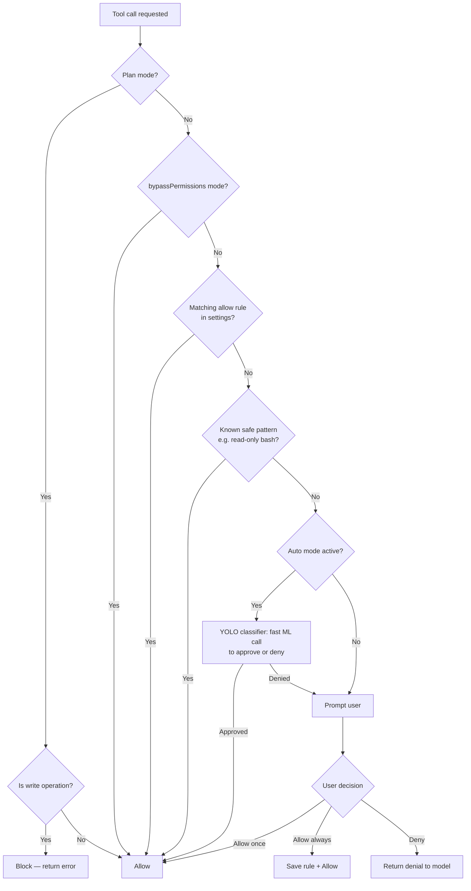
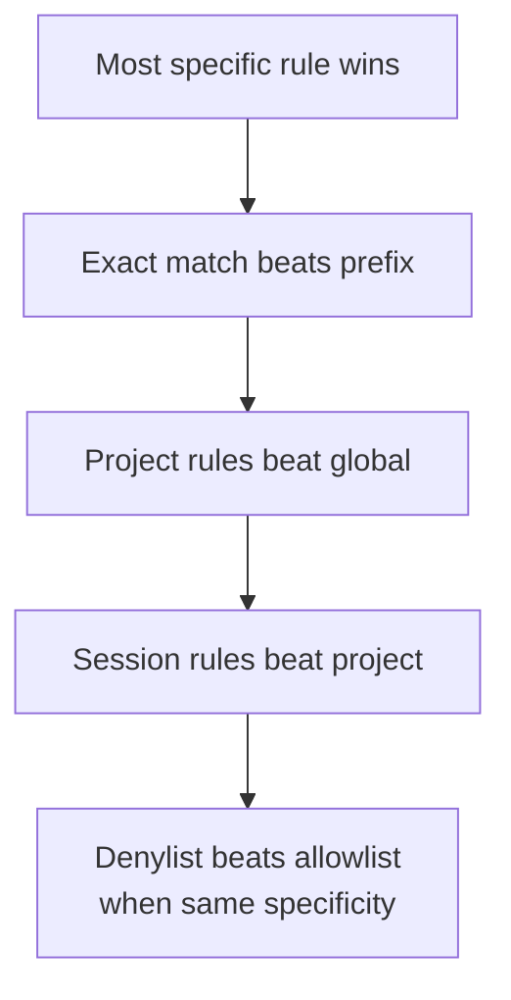
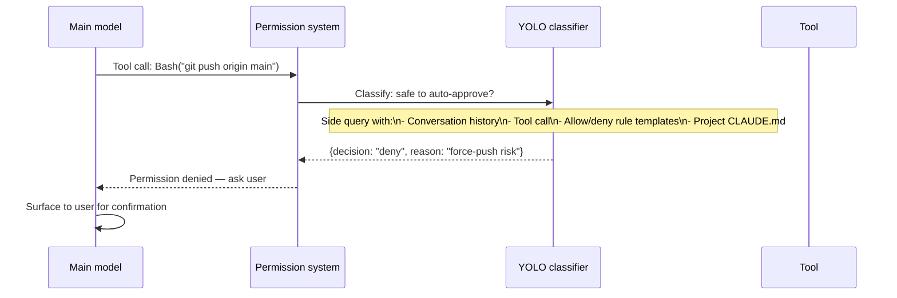
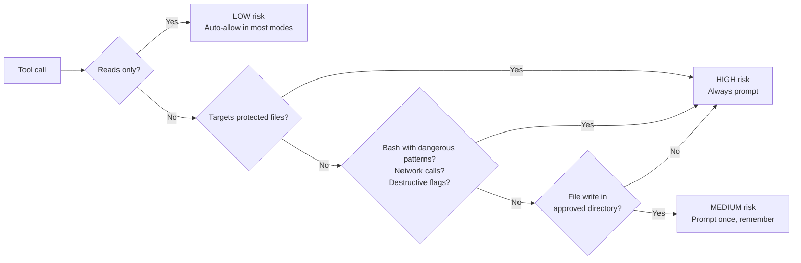
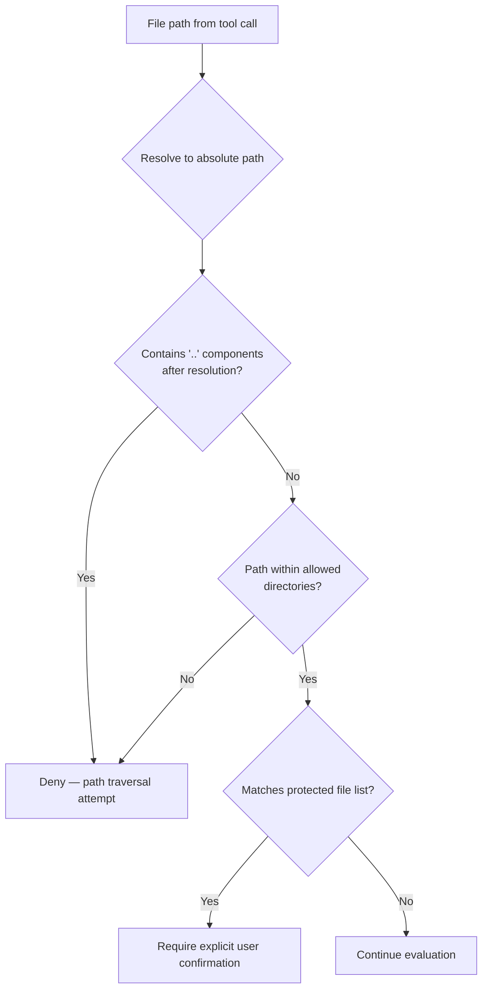
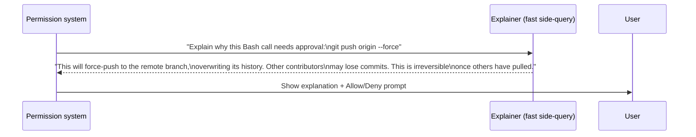
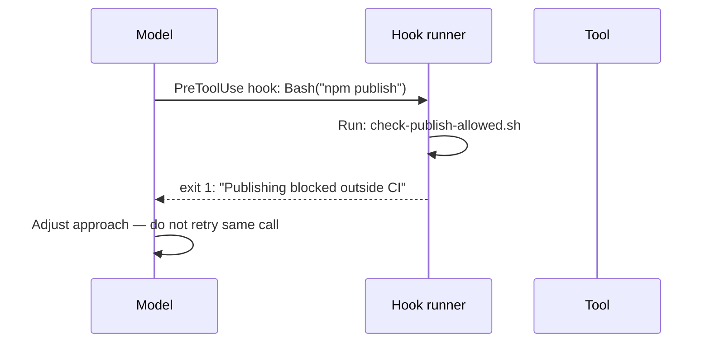

# Permission System

Claude Code's permission system controls whether tool calls execute automatically or require user approval. It combines rule-based evaluation, ML-based auto-approval, and multiple escalation modes — all designed around the principle that **the cost of pausing to confirm is low; the cost of an unwanted action can be very high**.

---

## Permission Modes

```mermaid
stateDiagram-v2
    [*] --> default : Session start
    default --> plan : /plan or UI toggle
    default --> acceptEdits : Shift+Tab
    acceptEdits --> bypassPermissions : escalate (ant-only)
    default --> bypassPermissions : --dangerously-skip-permissions
    default --> auto : Internal TRANSCRIPT_CLASSIFIER gate

    plan --> default : Exit plan mode
    acceptEdits --> default : Shift+Tab again

    note right of default
        Interactive — user prompted
        for risky tool calls
    end note
    note right of plan
        Read-only. Writes blocked.
        Used for safe exploration.
    end note
    note right of acceptEdits
        Auto-accepts file edits.
        Still prompts for Bash.
    end note
    note right of bypassPermissions
        All tool calls run without prompt.
        High-risk mode — shown in red UI.
    end note
    note right of auto
        ML classifier decides per-call.
        Internal only (TRANSCRIPT_CLASSIFIER gate).
    end note
```

| Mode | Symbol | Color | Description |
|------|--------|-------|-------------|
| `default` | — | normal | Interactive — user prompted for risky calls |
| `plan` | ⏸ | blue | Read-only; all writes blocked |
| `acceptEdits` | ⏵⏵ | yellow | Auto-accepts file edits, prompts for Bash |
| `bypassPermissions` | ⏵⏵ | **red** | All calls run without prompt |
| `dontAsk` | ⏵⏵ | red | Variant of bypass |
| `auto` | ⏵⏵ | orange | ML classifier per-call (internal only) |

---

## Permission Evaluation Flow

For every tool call, the permission system evaluates in order:



---

## Permission Rules

Rules are stored in settings and matched against tool calls. A rule has three parts:

```
Bash(git commit:*)    ← tool name + pattern
allow | deny          ← behavior
session | project | global  ← scope
```

### Rule examples

```
Bash(git commit:*)          → allow git commits
Bash(npm test:*)            → allow test runs
Bash(rm -rf:*)              → deny dangerous removals
FileEdit(src/**:*)          → allow edits under src/
Bash(*)                     → allow all bash (broad — dangerous in auto mode)
```

### Rule matching precedence



### Protected files

Certain files are always protected regardless of rules:

```
~/.gitconfig
~/.bashrc / ~/.zshrc / ~/.profile
~/.mcp.json
~/.claude.json
```

Any write to these requires explicit user confirmation even in `bypassPermissions` mode.

---

## YOLO Classifier (Auto Mode)

In `auto` mode, a separate ML call evaluates each tool call before it executes. This is a fast side-query — a secondary model call that runs in parallel with or just before the tool, not a full conversation turn.



The classifier receives:
- The current conversation history (truncated to fit)
- The specific tool call being evaluated
- A permissions template describing what's allowed in this project
- The `CLAUDE.md` content for project context

Two template variants exist: `permissions_external.txt` (all users) and `permissions_anthropic.txt` (internal, stricter).

### Dangerous pattern stripping

When entering `auto` mode, overly broad allow rules are automatically stripped to prevent them from bypassing the classifier:

```ts
// utils/permissions/dangerousPatterns.ts
const DANGEROUS_BASH_PATTERNS = [
  'python', 'node', 'deno', 'ruby', 'perl', // interpreter access
  'npx', 'bunx', 'npm run',                  // package runners
  'bash', 'sh', 'zsh',                       // shell escapes
  'eval', 'exec', 'env', 'xargs',            // arbitrary execution
  'sudo',                                     // privilege escalation
  'ssh',                                      // remote execution
]
```

A rule like `Bash(python:*)` would let the model run arbitrary Python, bypassing the classifier entirely. These rules are stripped at `auto` mode entry.

---

## Reversibility Classification

Before prompting the user, the system classifies the risk level of a tool call:



### Examples by risk level

| Tool call | Risk | Reason |
|-----------|------|--------|
| `Read(src/auth.ts)` | LOW | Read-only |
| `Bash(git status)` | LOW | Read-only git |
| `FileEdit(src/auth.ts, ...)` | MEDIUM | Write to source file |
| `Bash(git commit -m "...")` | MEDIUM | Local, reversible |
| `Bash(git push --force)` | HIGH | Hard to reverse, affects shared state |
| `Bash(rm -rf node_modules)` | HIGH | Destructive, irreversible locally |
| `FileEdit(~/.zshrc, ...)` | HIGH | Protected file |
| `Bash(curl ... | bash)` | HIGH | Network + code execution |

---

## Path Traversal Protection

The permission system validates file paths to prevent directory traversal attacks:



---

## Denial Tracking

The system tracks when the user denies a tool call and surfaces that context to the model:

```ts
// utils/permissions/denialTracking.ts
// When a user denies a tool call:
// 1. Record the denial in session state
// 2. Next time the model attempts the same call, include the prior denial
//    in the tool result so the model knows to try a different approach
```

This prevents the model from retrying a denied action in a loop — it receives the denial signal and must adapt its approach.

---

## Permission Explanations

When the user is prompted to approve a tool call, an explanation is generated by Claude itself:



The explanation is generated by a **separate, fast model call** — not the main conversation model — to keep latency low. The explanation is human-readable, not technical, and focuses on *what could go wrong* rather than *what the command does*.

---

## Hooks Integration

Users can configure shell commands that run in response to permission events:

```jsonc
// .claude/settings.json
{
  "hooks": {
    "PreToolUse": [
      {
        "matcher": "Bash",
        "hooks": [{ "type": "command", "command": "echo 'bash call: $TOOL_INPUT'" }]
      }
    ],
    "PostToolUse": [...],
    "Notification": [...]
  }
}
```

Hook output is treated as coming from the user. If a hook blocks a tool call (exits non-zero), the model sees the hook's output as a denial reason and adjusts its approach.



---

## Applying These Patterns

1. **Reversibility as the primary risk signal.** Classify actions by how hard they are to undo, not just by how dangerous they look. A `git push --force` is more dangerous than `rm *.tmp` in most contexts.

2. **Three levels of allow: once, always (session), always (project).** Give users granular control. "Allow once" is the safe default; "allow always" creates a saved rule. The distinction reduces friction without sacrificing control.

3. **Strip broad rules at escalated-mode entry.** When entering a less restrictive mode (auto-approve, bypass), audit existing rules and strip any that are too broad to be safe in that mode. Don't let a stale `Bash(*)` rule silently bypass your safety gates.

4. **Protect a short list of sacred files unconditionally.** Identify the files that, if modified, could cause severe user harm (shell configs, credential files, VCS config). Never allow writes to these without explicit confirmation, regardless of mode.

5. **Use fast side-queries for per-call decisions.** The YOLO classifier pattern — a small, fast model call that evaluates one specific action — is cheaper and more accurate than embedding classification logic in the main system prompt. Keep it separate.

6. **Track denials and surface them.** When a user denies an action, that signal must reach the model in a way that changes its behavior. A model that re-tries denied actions is a broken permission system.

7. **Hook integration for custom policies.** Shell hooks before/after tool execution let teams enforce org-specific policies (no publishing outside CI, no writes to prod config) without modifying the core system.
