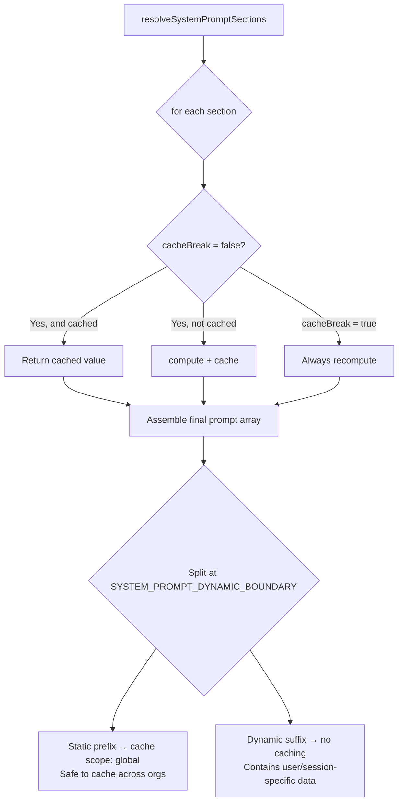
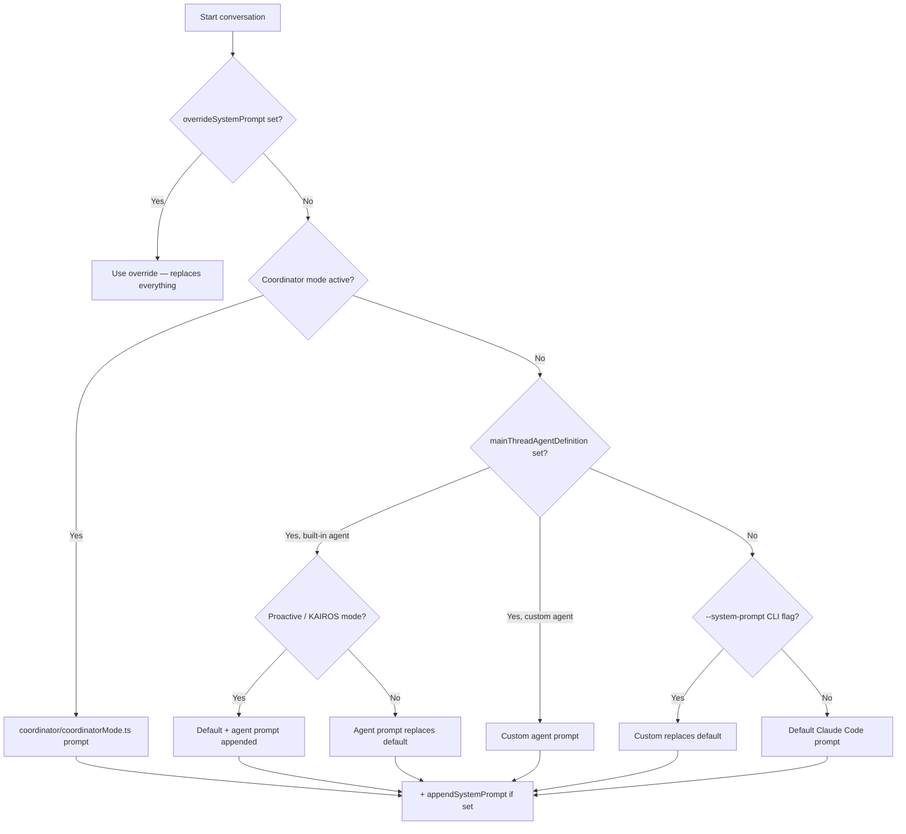
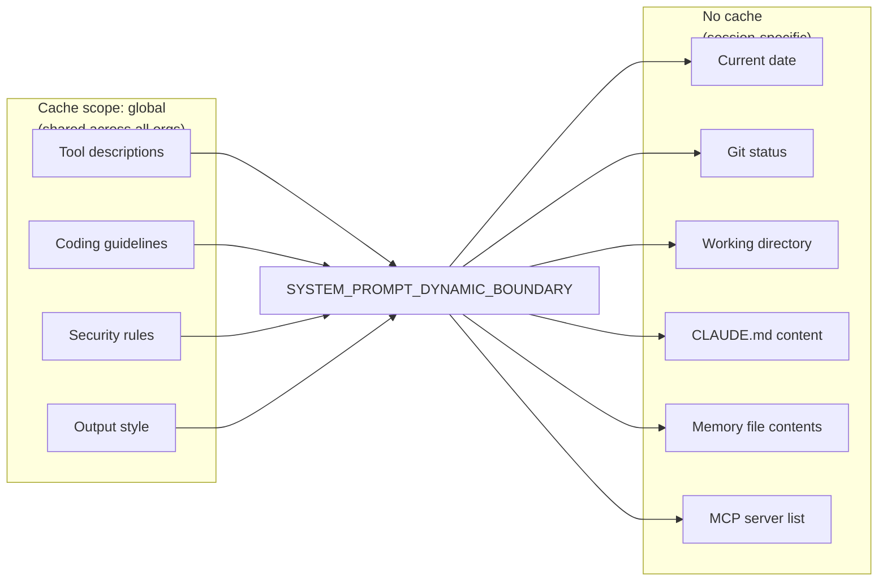

# Prompt Architecture

Claude Code treats prompts as first-class code — versioned, modular, and optimized with the same rigor as application logic. This document covers how the system prompt is constructed, how individual tool prompts work, and the design principles behind prompt-as-code.

---

## Core Concept: Prompts Are Code

Every tool, mode, and agent has a dedicated `prompt.ts` file. The convention is:

```
tools/
  BashTool/
    BashTool.ts        ← tool implementation
    prompt.ts          ← tool description sent to the model
    toolName.ts        ← exported constant for the tool name
  FileEditTool/
    FileEditTool.ts
    prompt.ts
    constants.ts
```

Tool names are exported as constants (`BASH_TOOL_NAME`, `FILE_EDIT_TOOL_NAME`) and imported by other prompt files — so cross-references between tool descriptions stay accurate when names change.

```ts
// tools/FileEditTool/prompt.ts
import { FILE_READ_TOOL_NAME } from '../FileReadTool/prompt.js'

// Result: "You must use your `Read` tool at least once..."
// If FileReadTool is renamed, this updates automatically.
```

---

## System Prompt Assembly Pipeline

The main system prompt is not a static string — it is assembled fresh on each conversation start from modular sections.



### Two section types

```ts
// Computed once, cached until /clear or /compact
systemPromptSection('git-status', () => getGitStatus())

// Recomputes every turn — breaks the prompt cache when it changes
// Requires a documented reason
DANGEROUS_uncachedSystemPromptSection(
  'current-time',
  () => new Date().toISOString(),
  'KAIROS needs real-time clock for scheduling decisions'
)
```

The cache-break distinction matters economically: prompt cache creation costs tokens. Volatile sections that change frequently (time, session state) are segregated from stable sections (tool descriptions, coding guidelines) so the stable sections stay cached across turns.

### The Dynamic Boundary

```ts
export const SYSTEM_PROMPT_DYNAMIC_BOUNDARY = '__SYSTEM_PROMPT_DYNAMIC_BOUNDARY__'
```

Everything **before** this marker in the prompt array is cacheable at global scope (shared across all organizations using the same model). Everything **after** contains user-specific or session-specific content and cannot be shared.

This is a significant cost optimization at scale: a single cached copy of the base instructions is reused across millions of sessions.

---

## Prompt Priority Stack

When a conversation starts, the system prompt is resolved in priority order:



### What the default prompt contains (assembled sections)

| Section | Cache type | Content |
|---------|-----------|---------|
| Intro / identity | Static | Who the model is, CYBER_RISK_INSTRUCTION |
| System rules | Static | How tool output is shown, injection warning, hooks |
| Doing tasks | Static | Coding style, over-engineering warnings, backwards-compat |
| Tool use guidance | Static | When to use Bash vs dedicated tools |
| Tone & style | Static | Emoji policy, response length |
| Output efficiency | Static | "Lead with the answer, not the reasoning" |
| Execution care | Static | Reversibility, blast radius |
| Agent tool section | Static | How to launch and brief agents |
| Memory section | Static | How to read/write persistent memory |
| Language preference | Dynamic | User's preferred response language |
| Git status | Dynamic | Current branch, recent commits |
| Working directory | Dynamic | `cwd`, file system context |
| CLAUDE.md content | Dynamic | Project-specific instructions |
| MCP servers | Dynamic | Connected MCP server names + instructions |
| Session date | Dynamic | Today's date (important for memory/planning) |

---

## Tool Prompt Conventions

Each tool prompt follows a consistent structure that the model uses to decide *when* and *how* to call a tool.

### Anatomy of a tool prompt

```
[One-line description of what the tool does]

[When to use / when NOT to use]

[Parameter descriptions with constraints]

[Usage tips — gotchas, best practices]

[Examples if the usage is non-obvious]
```

### Example: FileEdit tool

```ts
// tools/FileEditTool/prompt.ts (paraphrased)
`Performs exact string replacements in files.

Usage:
- You must use your Read tool at least once before editing.
  This tool will error if you attempt an edit without reading.
- Preserve exact indentation as it appears AFTER the line number prefix.
- ALWAYS prefer editing existing files. NEVER write new files unless required.
- Only use emojis if the user explicitly requests it.
- The edit will FAIL if old_string is not unique. Provide more context
  or use replace_all.`
```

The pre-read requirement is enforced at both the **prompt level** (the model is told to read first) and the **runtime level** (the tool errors if the file hasn't been read). Defense in depth.

### Example: Bash tool

```ts
// tools/BashTool/prompt.ts (paraphrased)
`- You can use run_in_background for commands where you don't need
  results immediately. You'll be notified when it finishes.
  Do not use '&' at the end — use the parameter instead.

// Commit/PR section varies by user type:
// External users: full git protocol inline
// Ant users: "use /commit and /commit-push-pr skills"
`
```

The Bash tool prompt is the most environment-sensitive — it branches on:
- `USER_TYPE === 'ant'` (shorter git instructions, skills-based workflow)
- `isUndercover()` (appends undercover instructions to prevent codename leaks in commits)
- `shouldIncludeGitInstructions()` (can be disabled)
- `hasEmbeddedSearchTools()` (use `find`/`grep` vs dedicated Glob/Grep tools)

### Example: AgentTool prompt (coordinator vs. normal)

```ts
// tools/AgentTool/prompt.ts (simplified)
export async function getPrompt(
  agentDefinitions,
  isCoordinator,    // ← coordinator gets slim version
  allowedAgentTypes
) {
  const shared = `Launch a new agent...`

  if (isCoordinator) {
    return shared  // Coordinator already has full instructions in its system prompt
  }

  // Non-coordinator gets the full prompt with:
  // - When NOT to use the Agent tool
  // - Usage notes (foreground vs background, run_in_background)
  // - Fork semantics (if isForkSubagentEnabled())
  // - "Writing the prompt" section
  // - Examples
  return `${shared}\n${whenNotToUse}\n${usageNotes}\n${examples}`
}
```

This is prompt deduplication: the coordinator already has detailed agent-orchestration instructions in its system prompt, so the tool description stays lean for that context.

---

## The "Doing Tasks" Section — Design Philosophy

The core behavioral instructions reveal a clear design philosophy worth understanding:

### Anti-over-engineering rules (verbatim from source)

> "Don't add features, refactor code, or make 'improvements' beyond what was asked. A bug fix doesn't need surrounding code cleaned up."

> "Don't create helpers, utilities, or abstractions for one-time operations. Don't design for hypothetical future requirements. The right amount of complexity is what the task actually requires — no speculative abstractions, but no half-finished implementations either. **Three similar lines of code is better than a premature abstraction.**"

> "Avoid backwards-compatibility hacks like renaming unused _vars, re-exporting types, adding `// removed` comments for removed code. If you are certain that something is unused, you can delete it completely."

### Execution care principles

> "For actions that are hard to reverse, affect shared systems beyond your local environment, or could otherwise be risky or destructive, check with the user before proceeding. The cost of pausing to confirm is low, while the cost of an unwanted action (lost work, unintended messages sent, deleted branches) can be very high."

### Output efficiency

> "Go straight to the point. Try the simplest approach first. Lead with the answer or action, not the reasoning. Skip filler words, preamble, and unnecessary transitions. Do not restate what the user said — just do it."

These aren't style preferences — they are explicit rules in the system prompt that shape every response.

---

## Feature-Gated Prompt Sections

Prompt content is gated by compile-time feature flags using Bun's `feature()` function with dead-code elimination:

```ts
import { feature } from 'bun:bundle'

// Only included in KAIROS/PROACTIVE builds
const proactiveModule = feature('PROACTIVE') || feature('KAIROS')
  ? require('../proactive/index.js')
  : null

// External builds get a different permissions template than ant builds
const BASE_PROMPT = feature('TRANSCRIPT_CLASSIFIER')
  ? require('./yolo-classifier-prompts/auto_mode_system_prompt.txt')
  : ''
```

And runtime user-type checks:

```ts
// Ant-only: more aggressive comment-writing guidance
// (addressing a specific failure mode: "Capybara over-comments by default")
if (process.env.USER_TYPE === 'ant') {
  items.push(
    `Default to writing no comments. Only add one when the WHY is non-obvious...`
  )
}
```

The inline comment `// @[MODEL LAUNCH]: Update comment writing for Capybara — remove or soften once the model stops over-commenting` shows how prompt changes are tracked against model behavior — behavior regressions get fixed in the prompt, with a note to remove the fix when the model improves.

---

## Prompt Caching Strategy



**Agent list optimization:** The list of available agent types was originally embedded in the `AgentTool` tool description. This caused a full cache bust every time an MCP server connected or a permission mode changed (which mutates the list). The fix: inject the agent list as an `agent_listing_delta` attachment message instead, keeping the tool description static.

```ts
// The dynamic agent list was ~10.2% of fleet cache_creation tokens.
// Now gated behind shouldInjectAgentListInMessages()
```

---

## Undercover Mode — Prompt Injection Defense

When operating in public repos, a special mode prevents the model from leaking internal Anthropic information (model codenames, staging URLs, internal tooling):

```ts
// utils/undercover.ts
// Auto-activates unless in an internal repo allowlist
// No force-OFF — stays undercover by default

// Added to BashTool prompt for ant users in public repos:
"Do not mention internal model codenames (Capybara, Tengu, etc.)
 in commit messages, PR descriptions, or any user-visible output."
```

This is injected into the **BashTool prompt** specifically because commit messages are the highest-risk surface for codename leaks.

---

## Applying These Patterns

1. **One prompt file per tool.** Keep tool descriptions close to their implementation. Export tool names as constants and import them cross-references.

2. **Separate static from dynamic.** Mark a boundary in your system prompt between content that's safe to cache globally and content that changes per user/session. This has real cost implications at scale.

3. **Use `DANGEROUS_` naming conventions** for sections that bust the cache. The naming forces the author to document why cache-breaking is necessary.

4. **Prompt behavior vs. runtime enforcement.** For critical constraints (read before edit, don't run without confirmation), enforce at both the prompt level and the code level. Prompts can be worked around; code cannot.

5. **Annotate model-behavior workarounds.** When you add a prompt rule to fix a model behavior regression, note what model version it targets and when it can be removed. `// @[MODEL LAUNCH]: remove once ...` is a clean convention.

6. **Feature-gate prompt sections.** Don't ship internal-only instructions to external builds. Compile-time dead-code elimination (not runtime checks) is the cleanest approach.
